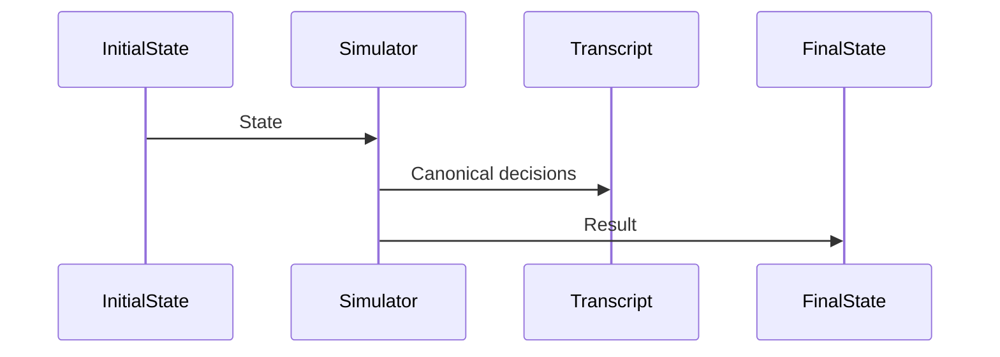

Blockchain Monster Battler Protocol

Volume I — Architecture and Constitutional Specification

Document: BMBP-ARCH-0001
Version: Draft 0.1
Status: Living Specification
Scope: Architecture
Normative Language: SHALL, SHOULD and MAY are to be interpreted as described in RFC 2119.

⸻

Preface

This document intentionally does not describe a game.

It describes the architectural principles governing a family of deterministic simulation systems whose current reference implementation is a creature-collection role-playing game named Blockchain Monster Battler.

The purpose of this specification is to define the architectural invariants that SHALL remain true regardless of implementation language, networking model, blockchain platform or deployment topology.

Consequently, this specification deliberately distinguishes between architectural principles, which are expected to remain stable for the lifetime of the protocol, and implementation decisions, which are expected to evolve.

For example:

Architectural Principle	Current Implementation Decision
Gameplay execution SHALL remain independent from blockchain execution.	The reference client is implemented in Odin.
Simulation SHALL be deterministic.	The reference server will initially be authoritative.
Economically meaningful state SHALL be externally verifiable.	Cardano + Hydra is currently the preferred settlement platform.
Randomness SHALL be publicly auditable.	The exact randomness provider remains under evaluation.

Replacing Odin, Cardano or Hydra SHALL NOT invalidate this specification provided the architectural principles continue to hold.

⸻

1. Introduction

Status

Type: Foundational

Normative: Yes

⸻

Blockchain Monster Battler originates from a single architectural observation:

Blockchains are exceptionally good at enforcing constitutional rules, and exceptionally poor at executing real-time simulations.

Most blockchain games attempt one of two extremes.

The first treats the blockchain as little more than a distributed asset registry. Gameplay remains entirely conventional, while creatures, items or cosmetics are represented as transferable tokens.

The second attempts to execute gameplay directly inside smart contracts, making the blockchain responsible for combat, progression, world simulation and state updates.

Both approaches have significant shortcomings.

The former derives little benefit from decentralisation beyond ownership.

The latter inherits every limitation of public blockchains:

* latency
* transaction fees
* limited throughput
* difficult upgrades
* publicly observable intermediate state
* expensive computation

This specification adopts a fundamentally different position.

The blockchain SHALL function as the constitutional layer of the game.

The simulation SHALL remain native.

⸻

2. Constitutional Architecture

Status

Type: Foundational Principle

Normative: Yes

⸻

The protocol divides responsibility into two distinct domains.

flowchart TD
A[Deterministic Simulation]
B[State Transition]
C[Cryptographic Verification]
D[Blockchain Settlement]
A --> B
B --> C
C --> D

Only the final stage requires blockchain execution.

Everything preceding settlement SHALL remain blockchain-independent.

This separation exists for several reasons.

2.1 Native execution

Real-time games demand:

* low latency
* high simulation throughput
* inexpensive iteration
* large-scale testing
* rapid balancing

These characteristics are fundamentally incompatible with public blockchain execution.

The simulation SHALL therefore execute natively.

The blockchain SHALL never become the battle engine.

⸻

2.2 Constitutional responsibilities

The blockchain SHALL instead enforce rules whose value derives from decentralisation.

Examples include:

* creature ownership
* scarcity
* seasonal issuance
* breeding permissions
* evolution approval
* tournament settlement
* marketplace integrity
* publicly verifiable randomness
* cryptographic progression checkpoints

These properties benefit from independent verification.

Movement, damage calculation or AI do not.

⸻

2.3 Simulation responsibilities

The deterministic simulator SHALL remain responsible for:

* combat
* AI
* exploration
* pathfinding
* movement
* temporary effects
* animations
* local prediction
* replay
* balancing
* statistical analysis

These responsibilities derive value from performance rather than decentralisation.

⸻

3. Architectural Principles

Status

Type: Foundational

Normative: Yes

⸻

The following principles define the protocol.

No implementation decision SHALL violate them.

⸻

Principle I

Simulation Independence

Gameplay execution SHALL remain independent from blockchain execution.

No gameplay system SHALL require smart contract execution merely to function.

The game SHALL remain playable without blockchain connectivity provided economically meaningful actions are deferred.

⸻

Principle II

Deterministic First

The simulator SHALL be deterministic.

Given:

* identical initial state
* identical commands
* identical ruleset
* identical random seed

every implementation SHALL produce identical output.

⸻

Principle III

Replayability

Every economically meaningful transition SHALL be replayable.

Replay exists for:

* debugging
* verification
* auditing
* regression testing
* dispute resolution
* future proof generation

Replay SHALL therefore become a first-class architectural concern rather than a debugging feature.

⸻

Principle IV

Economic Invariants

The blockchain SHALL protect economic rules.

The simulator SHALL never possess unilateral authority to violate:

* ownership
* scarcity
* breeding constraints
* evolution requirements
* seasonal issuance

⸻

Principle V

Cryptographic Verifiability

The protocol SHALL favour cryptographic verification over institutional trust whenever economically feasible.

Initially this verification MAY consist of server signatures.

Future implementations MAY replace those signatures with:

* distributed validation
* fraud proofs
* validity proofs

without modifying the deterministic simulator.

⸻

Principle VI

Implementation Independence

No architectural principle SHALL depend upon:

* Odin
* Rust
* Cardano
* Hydra
* Solana
* Sui
* Avalanche

These are implementation choices.

The architecture exists independently of them.

⸻

4. System Overview

Status

Type: Stable Architecture

Normative: Yes

⸻

The reference architecture consists of four major components.

flowchart LR
Client --> Simulator
Simulator --> Transition
Transition --> Settlement
Settlement --> Blockchain

Each component possesses clearly defined responsibilities.

⸻

4.1 Client

Current implementation

The reference client SHALL initially be implemented in Odin.

This is an implementation decision.

The architecture imposes no requirement regarding implementation language.

The client is responsible for:

* presentation
* local input
* prediction
* replay
* user interaction

The client SHALL NOT become authoritative.

⸻

4.2 Deterministic Simulator

The simulator constitutes the core of the protocol.

It receives:

* world state
* player commands
* deterministic seed
* ruleset

and produces:

* updated state
* transcript
* state transition

The simulator SHALL remain pure.

Its output SHALL depend exclusively upon its input.

It SHALL NOT depend upon:

* wall-clock time
* network latency
* operating system
* blockchain state
* floating scheduling decisions

⸻

4.3 State Transition Layer

Rather than persisting arbitrary game events, the architecture centres around state transitions.

Conceptually:

State₀
↓
Transition
↓
State₁

The protocol therefore reasons about state rather than events.

This distinction is significant.

Events are transient.

State is authoritative.

⸻

4.4 Settlement Layer

Settlement exists to convert validated state transitions into economically meaningful commitments.

Settlement MAY involve:

* ownership updates
* evolution
* breeding
* reward issuance
* seasonal progression

Settlement SHALL remain substantially less frequent than gameplay execution.

⸻

5. Deterministic Simulation

Status

Type: Foundational

Normative: Yes

⸻

Determinism represents the most important architectural decision within the protocol.

Without determinism:

* replay fails
* validation fails
* distributed execution diverges
* fraud proofs become impossible
* validity proofs become impractical

Accordingly, every subsystem SHALL preserve deterministic behaviour.

⸻

5.1 Canonical Inputs

Every simulation SHALL depend exclusively upon:

Initial State
Ruleset Version
Player Commands
Deterministic Seed

No additional hidden inputs SHALL exist.

⸻

5.2 Native Simulation

The simulator SHALL execute natively.

The architecture deliberately rejects smart-contract execution for gameplay.

Reasons include:

* simulation throughput
* local iteration
* balance testing
* debugging
* replay
* hardware utilisation

Millions of simulated battles SHALL be executable locally without requiring blockchain infrastructure.

This requirement exists primarily to support balancing.

Designing a competitive game requires statistical analysis across enormous numbers of simulations.

Such analysis would be economically and technically infeasible if every battle required blockchain execution.

⸻

5.3 Local Simulation

The protocol intentionally distinguishes between simulation and settlement.

A developer SHALL be capable of executing:

* thousands
* millions
* eventually billions

of simulated encounters entirely offline.

These simulations SHALL produce exactly the same transitions that later become eligible for settlement.

Consequently, blockchain infrastructure is removed from the balancing loop.

⸻

5.4 Deterministic Arithmetic

The simulator SHALL avoid implementation-defined behaviour.

Although the exact arithmetic representation remains an implementation detail, the protocol recognises several well-known sources of divergence:

* floating-point rounding
* undefined overflow
* platform-dependent math libraries
* thread scheduling
* non-deterministic iteration order

Future protocol revisions SHALL specify canonical arithmetic where necessary.

The architectural requirement is simpler:

Every conforming implementation SHALL produce identical results from identical inputs.

⸻

6. State Transition Architecture

Status

Type: Stable Architecture

Normative: Yes

⸻

The protocol does not consider battles to be authoritative.

Instead, battles produce state transitions.

Conceptually:

Initial State
↓
Simulation
↓
Transition
↓
Final State

Only the transition becomes eligible for settlement.

The protocol intentionally avoids prescribing a concrete binary format at this stage.

However, every transition SHALL conceptually contain:

* reference to the initial state
* reference to the ruleset
* deterministic seed
* player commands
* resulting state
* transcript integrity information

The exact encoding remains an open question.

What is architecturally significant is that a transition SHALL be independently reproducible.

A future implementation MAY verify this through:

* server signatures,
* distributed validator consensus,
* fraud proofs,
* or zero-knowledge validity proofs,

without requiring any modification to the simulator itself.

This separation between simulation and verification is the foundation upon which the remainder of the protocol is built.

# 7. Replay and Verifiability

**Status:** Stable

**Type:** Foundational Architecture

**Normative:** Yes

---

Replay is not a debugging feature.

Replay is a protocol primitive.

This distinction influences almost every architectural decision made throughout the system.

Many games implement replay as a recording of gameplay intended for spectators or debugging. Such replay systems are frequently lossy. They depend upon implementation details, network packets, timing information or animation events.

Blockchain Monster Battler adopts the opposite philosophy.

A replay SHALL constitute a cryptographic proof that a particular deterministic transition occurred.

Accordingly, replay is not defined as "playing the battle again."

Replay is defined as reconstructing an identical state transition from canonical inputs.

The simulator therefore becomes a pure function.

```
FinalState =
    Simulate(
        InitialState,
        Ruleset,
        Commands,
        BattleSeed
    )
```

Every conforming implementation SHALL produce the same output.

---

## 7.1 Replay Objectives

Replay exists to satisfy multiple independent concerns.

### Verification

Players SHALL be capable of independently verifying important transitions.

For example:

- evolution
- breeding
- tournament victory
- legendary capture

These transitions should never depend exclusively upon trusting a server.

---

### Regression Testing

A battle that once produced a specific outcome SHALL continue producing that outcome unless:

- the ruleset changes; or
- the replay explicitly targets another ruleset version.

This allows entire historical battle corpora to become regression suites.

---

### Statistical Simulation

Replay enables deterministic balance analysis.

A developer can execute:

```
1,000,000 battles

↓

Adjust one balance parameter

↓

Replay the corpus

↓

Observe distribution changes
```

without involving networking or blockchain infrastructure.

This is one of the primary motivations behind separating simulation from settlement.

---

### Future Validity Proofs

Perhaps the most important motivation is future compatibility.

A replay transcript already contains almost everything necessary for:

- fraud proofs
- validity proofs
- deterministic dispute resolution

The architecture therefore avoids designing a replay system that would later need replacement.

---

# 8. Transcript Integrity

**Status:** Stable

**Type:** Architecture

**Normative:** Yes

---

The protocol distinguishes between:

- simulation,
- transcript,
- state.

These concepts are related but not identical.

Simulation is computation.

Transcript is evidence.

State is authority.

A transcript SHALL therefore contain sufficient information to demonstrate that a deterministic transition occurred.

It SHOULD NOT become an event log for gameplay analytics.

The architecture intentionally avoids storing every visual or cosmetic event.

Instead, the transcript represents the canonical sequence of simulation decisions.

Conceptually:



The transcript is therefore a by-product of simulation rather than an independent authority.

---

## 8.1 Transcript Hashing

Rather than immediately storing entire transcripts on-chain, the protocol introduces transcript hashing.

Conceptually:

```
Transcript

↓

Canonical Encoding

↓

Cryptographic Hash

↓

Settlement
```

The exact hashing algorithm remains an implementation decision.

The architectural requirement is that identical transcripts SHALL always produce identical hashes.

Transcript hashes primarily exist to support:

- replay verification
- settlement
- dispute resolution
- future proof systems

---

## 8.2 State Hashing

Similarly, every authoritative state SHOULD possess a canonical hash.

The protocol deliberately avoids defining binary layouts at this stage.

Nevertheless:

```
State

↓

Canonical Representation

↓

Hash
```

must always produce identical results.

The distinction between transcript hashes and state hashes is important.

A transcript describes *how* a transition occurred.

A state describes *what currently exists.*

---

# 9. Randomness

**Status:** Stable

**Type:** Foundational Principle

**Normative:** Yes

---

Randomness represents one of the few aspects of gameplay that benefits directly from cryptographic infrastructure.

However, randomness SHALL NOT imply nondeterminism.

Instead:

The protocol requires **externally unpredictable but internally deterministic randomness.**

These are fundamentally different properties.

---

## 9.1 Desired Properties

Battle randomness SHALL satisfy:

- unpredictable before commitment;
- deterministic after revelation;
- publicly auditable;
- replayable;
- implementation independent.

These requirements eliminate many conventional random number generators.

---

## 9.2 Battle Seed

Every battle conceptually receives one master seed.

```
Battle

↓

BattleSeed

↓

Deterministic PRNG

↓

Entire Simulation
```

The exact derivation algorithm remains open.

Nevertheless, the architecture establishes an important invariant:

No subsystem SHALL independently invent randomness.

Every random decision SHALL ultimately derive from the BattleSeed.

---

## 9.3 Derived Streams

The protocol deliberately avoids sequential global randomness.

Instead, independent streams SHOULD conceptually exist.

For example:

```
BattleSeed

├── Initiative

├── Accuracy

├── Critical Hits

├── AI

└── Rewards
```

The motivation is architectural.

Suppose balancing changes cause the AI to consume one additional random value.

If a single sequential stream existed, every later random event would change.

Independent derivation avoids this coupling.

Randomness therefore becomes structurally partitioned.

---

## 9.4 External Entropy

The BattleSeed SHALL ultimately originate from an externally verifiable source.

Candidate implementations discussed include:

- blockchain VRF;
- distributed randomness beacons;
- threshold randomness;
- commit-reveal protocols.

No decision has yet been made.

The architectural requirement is stronger than the implementation.

The protocol requires that no participant can predict economically meaningful randomness before commitment.

---

# 10. Economy and Supply

**Status:** Stable

**Type:** Architecture

**Normative:** Yes

---

Perhaps the most unusual aspect of the protocol concerns creature supply.

The protocol intentionally rejects fixed issuance schedules.

Instead, supply SHALL evolve according to ecosystem conditions.

The original idea proposed supply proportional to wallet count.

This was rejected.

Wallets are inexpensive to create.

Consequently, wallet count measures almost nothing.

---

## 10.1 Sybil Resistance

The protocol therefore distinguishes:

```
Wallet

≠

Player
```

Supply SHALL eventually depend upon active participation rather than addresses.

Exactly how participation is measured remains an open problem.

Potential signals discussed include:

- account age;
- meaningful gameplay;
- seasonal activity;
- progression;
- anti-Sybil heuristics.

No specific algorithm has been adopted.

---

## 10.2 Constitutional Supply

Supply becomes part of the constitutional layer.

The simulator SHALL never mint creatures arbitrarily.

Instead, issuance SHALL follow publicly defined protocol rules.

This distinction is important.

Gameplay may remain centralised.

Economics should not.

---

# 11. Settlement

**Status:** Stable

**Type:** Architecture

**Normative:** Yes

---

Settlement converts validated simulation into economically meaningful state.

Settlement SHALL occur significantly less frequently than gameplay.

The architecture intentionally separates:

```
Gameplay

↓

Transition

↓

Validation

↓

Settlement
```

This reduces blockchain utilisation while preserving economic integrity.

---

## 11.1 Settled Actions

Examples include:

- creature creation;
- ownership transfer;
- evolution;
- breeding;
- tournament rewards;
- progression checkpoints.

Damage rolls, movement and temporary effects SHALL remain outside settlement.

---

## 11.2 Evolution of Trust

The protocol explicitly anticipates several implementation stages.

### Stage 1

Authoritative server.

The server signs transitions.

### Stage 2

Regional execution.

Multiple validating nodes agree upon transitions.

### Stage 3

Fraud proofs.

Transitions become challengeable.

### Stage 4

Validity proofs.

Transitions become cryptographically provable.

The remarkable property of this evolution is that the deterministic simulator remains unchanged.

Only the verification layer evolves.

---

# 12. Regional Execution

**Status:** Draft

**Type:** Architecture

**Normative:** Informative

---

The protocol distinguishes local execution from global settlement.

This distinction motivated investigation into several blockchain ecosystems.

Rather than requiring every simulation to execute globally, the protocol allows regional execution environments.

Examples include:

- Hydra Heads;
- sovereign Avalanche L1s;
- validator committees.

These execute gameplay locally before eventual settlement.

The precise topology remains an implementation decision.

---

# 13. Blockchain Evaluation

The following reflects the current architectural assessment.

| Platform | Assessment |
|----------|------------|
| Cardano + Hydra | Strongest current candidate due to deterministic philosophy and regional execution model. |
| Avalanche L1 | Strong alternative if the game evolves toward a sovereign chain. |
| Solana | Excellent tooling, ecosystem and throughput. Strong public-chain option. |
| Sui | Elegant object model particularly suited to creature ownership. |
| NEAR | Interesting Rust ecosystem but currently lower priority. |
| Aptos | Technically capable though less aligned with current architectural priorities. |

These rankings are explicitly **implementation decisions**.

Changing settlement platforms SHALL NOT alter the architectural principles defined by this specification.

---

# 14. Open Questions

The following remain intentionally unspecified.

- Creature genetics.
- Battle mechanics.
- Binary protocol layouts.
- Marketplace protocol.
- Inventory model.
- Networking protocol.
- Cryptographic primitives.
- Randomness provider.
- State encoding.
- Canonical replay format.

Future protocol documents SHALL specify these independently.

---

# Appendix A — Terminology

**Architectural Principle**

An invariant expected to survive implementation changes.

**Implementation Decision**

A replaceable engineering choice satisfying one or more architectural principles.

**Settlement**

Conversion of validated simulation into economically meaningful blockchain state.

**Replay**

Deterministic reconstruction of a state transition.

**Battle Seed**

The externally derived deterministic entropy source for a simulation.

**Constitutional Layer**

The blockchain subsystem responsible for enforcing economic invariants without executing gameplay.

---

# Closing Remarks

The defining characteristic of Blockchain Monster Battler is not that it uses a blockchain.

It is that the blockchain is intentionally restricted to the role it performs best.

Simulation remains native.

Gameplay remains performant.

Economics become independently verifiable.

This separation allows the project to evolve from a trusted authoritative server toward increasingly decentralised verification—regional validators, fraud proofs and eventually zero-knowledge validity proofs—without requiring the simulation engine itself to change.

The architecture therefore treats decentralisation not as a replacement for game engine engineering, but as a mechanism for enforcing trust in the economy, ownership and progression of an otherwise conventional deterministic game.
